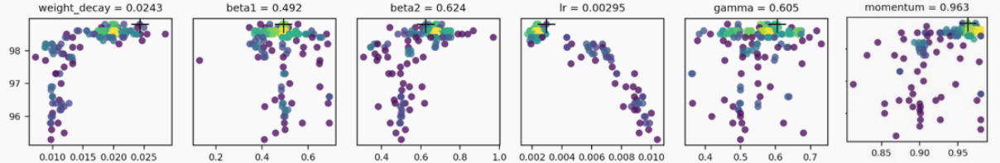

# Genetic_Algorithm_For_Hyperparameter_Tuning

This code in this repo is an adaptation of Ultralytic's Yolo5 Genetic Algorithm (roughly explained here: https://github.com/ultralytics/yolov5/issues/607) for a simple CNN trained on MNIST. 

## Introduction

Hyperparameters in ML control various aspects of training, and finding optimal values for them can be a challenge.
Traditional methods like grid searches can quickly become intractable due to:

* the high dimensional search space
* unknown correlations among the dimensions, and
* expensive nature of evaluating the fitness at each point, making GA a suitable candidate for hyperparameter searches.

## Initialization

This simple CNN has 5 hyperparameters used for various training settings. The parameters to start with are defined in hyp.scratch.yaml file. 
Better initial guesses will produce better final results, so it is important to initialize these values properly before evolving: a variability of 0.2 is not enough for an exhaustive investigation of the search space. However, a good initial set of parameters is usually given for well-known models. The idea is to fine tune them for a specific dataset. 

 If a good set of initial parameters are not available it would be suitable to start with a coarsed grained grid search, so that at least the magnitude of the hyperparameters are good enough.

## Define Fitness

Fitness is the value we seek to maximize. For this simple CNN we have defined fitness as the negative log likelihood loss. This value is maxized by
searching an optimal combination of the following values: weight decay, beta1 (Adam parameter), beta2 (Adam parameter), learning rate, gamma, momentum.

## Results

Evolution is very expensive and time consuming, as the base scenario is trained hundreds of times, possibly requiring hundreds or thousands of GPU hours. In this case the models were just trained for 5 epochs

